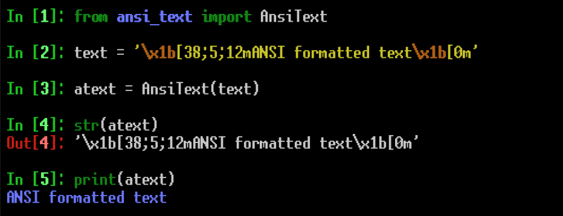
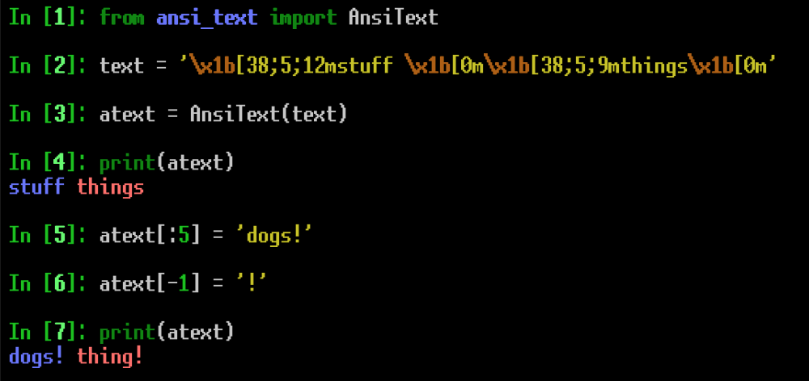

# ANSI text
This repo contains code for reading and manipulating text that has had formatting applied using ANSI escape sequences (colored foreground, colored background, bold, underline, etc.).

This isn't really all that useful for composing ANSI formatted text, it's
more of a utility for easily editing text that already has had ANSI
formatting applied to it. Once text has been read into an AnsiText object, he text can then be accessed and manipulated in a number of ways. 

## Reading text into AnsiText object:
If you have a string of text that already has ANSI formatting applied to it, you can read it into an AnsiText object when the AnsiText object is created:
```python
>>> text = '\x1b[38;5;12mANSI formatted text\x1b[0m'
>>> atext = AnsiText(text)
```

or by using the 'read' method:
```python
>>> text = '\x1b[38;5;12mANSI formatted text\x1b[0m'
>>> atext.read(text)
```

## Reading from AnsiText object:
Operations that use the __str__() method, such as print() or str(), will receive the formatted text. If you use str(), you'll be able to see the escape sequences used to format the text. If you use print(), the colored string will be visible in your terminal:


The unformatted text can be accessed using either the 'plaintext' attribute:
```python
>>> text = '\x1b[38;5;12mANSI formatted text\x1b[0m'
>>> atext = AnsiText(text)
>>> atext.plaintext
ANSI formatted text
```
or by indexing into the AnsiText object, as though it were an ordinary string:
```python
>>> text = '\x1b[38;5;12mANSI formatted text\x1b[0m'
>>> atext.read(text)
>>> atext[:]
'ANSI formatted text'
>>> atext[3:11]
'I format'
```
## Writing to AnsiText object:
The text can also be edited. The user can edit the plaintext through the 

