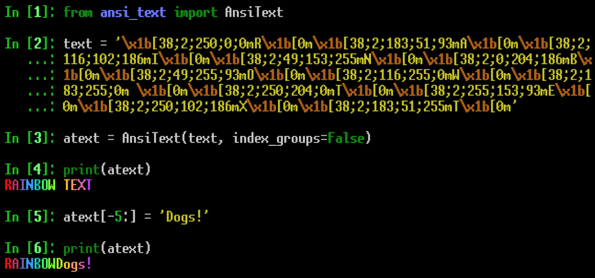

# ANSI Text
This repo contains code for reading and manipulating text that has had formatting applied using ANSI escape sequences (colored foreground, colored background, bold, underline, etc.).

This isn't really all that useful for composing ANSI formatted text, it's
more of a utility for easily editing text that already has had ANSI
formatting applied to it. Once text has been read into an AnsiText object, the text can then be accessed and manipulated in a number of ways. 

## Introduction
ANSI escape sequences are special sequences of characters that tell a terminal, terminal-like interpreter, Jupyter Notebook, etc. to do something. They can do a lot of stuff, but for the purposes of this README we'll just say "ANSI escape sequences are magical strings of characters that can change the color of text or apply formatting (like making the text bold or underlined)." If you'd like to learn more, [this Wikipedia article goes more in depth.](https://en.wikipedia.org/wiki/ANSI_escape_code)

Here is an example of some ANSI formatted text:

There's a chunk at the beginning that tells the terminal to to set the text color to blue:

    \x1b[38;5;12m

Then there's the text:

    ANSI formatted text

And finally there's a sequence that tells the terminal to reset all attributes to their default values:

    \x1b[0m


## Reading text into AnsiText object:
If you have a string of text that already has ANSI formatting applied to it, you can read it into an AnsiText object when the AnsiText object is created:
```python
>>> text = '\x1b[38;5;12mANSI formatted text\x1b[0m'
>>> atext = AnsiText(text)
```

or by using the 'read' method:
```python
>>> text = '\x1b[38;5;12mANSI formatted text\x1b[0m'
>>> atext.read(text)
```

## Reading from AnsiText object:
Operations that use the __str__() method, such as print() or str(), will receive the formatted text. If you use str(), you'll be able to see the escape sequences used to format the text. If you use print(), the colored string will be visible in your terminal:


The unformatted text can be accessed using the 'text' attribute:
```python
>>> text = '\x1b[38;5;12mANSI formatted text\x1b[0m'
>>> atext = AnsiText(text)
>>> atext.text
ANSI formatted text
```
## Editing AnsiText object:
When the text is read into the AnsiText object it will detect if the formatting changes through the string. The plaintext and formatting information for each of these is stored in an AnsiSubString object. 

These substrings can be accessed either through the groups attribute, or by indexing into the AnsiText object. This also allows for item assignment, which will replace the plaintext for a given group while retaining the ANSI formatting. This means that the size of the text can change (see below, where 'stuff' is replaced with 'Doggos!').


## Alternate indexing mode

There are some use cases where the method of indexing demonstrated above wouldn't make sense. For example, if the color of the text changes with each letter, as would be the case if a gradient has been applied to it. In this situation it would be very cumbersome to edit the text, since the user would need to assign each letter to a separate group. 

The alternate indexing mode addresses this problem. When this mode is active, indexing operations will refer to the unformatted text as a whole. No matter how many groups there are in, AnsiText object atext accessed as atext[n] will return the character at position 'n' in the unformatted text. 



You can think of the unformatted text as a list: this allows for slicing operations, etc., but it may lead to some unexpected behavior. The text will always be truncated to the length of the original unformatted text, and if you provide a string that's larger than the span of the slice it will "run over", overwriting text past the stop value.


The user can cause the AnsiText object to use the alternate indexing mode either by setting the 'index_groups' argument to False when the object is created, or by setting the 'index_groups' attribute to False. 